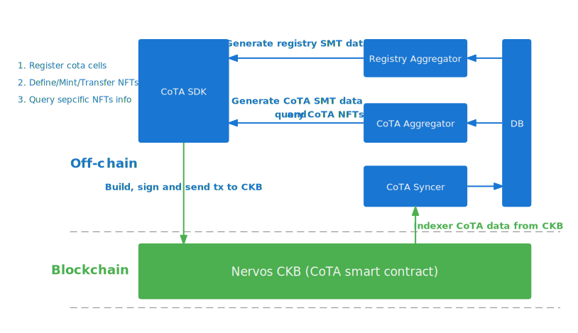

## Protocols

CoTA protocol uses [SMT](https://github.com/nervosnetwork/sparse-merkle-tree) to manage users' NFT assets, and all the NFT information of someone will be folded into his/her own SMT, and the SMT will be changed just only when the owner unlock the transaction with his/her private key. The SMT root hash will be saved into blockchain to reduce the on-chain data size and everyone should be registered first to get only one CoTA cell.

The transfer contains two steps: sender withdrawal and receiver claim. Withdrawal means sender losing the ownership of an NFT and the hold leaf will be removed from his/her SMT. Claim means the receiver getting the ownership of an NFT and the hold leaf will be added to his/her SMT and claim must be after withdrawal.

The CoTA SMT includes four kinds of token related leaves: define, hold, withdrawal and claim.

- The define leaf provides a template to define the NFT collection information, including total, name, description and image url, etc. Minting NFTs will be possible after defining and the minted NFTs will be share the same collection information and they are distinguished by different token indexes.
- The hold leaf means owning an NFT and you can update the NFT information or withdraw the NFT to others. When an NFT is withdrew to others, the hold leaf of the NFT will be removed.
- The withdrawal leaf means losing the ownership of an NFT and the withdrawal leaf value contains the next owner of the NFT. The withdraw leaf will not be removed once created.
- The claim leaf means once owning an NFT and the claim leaf will not be removed once created. When an NFT has been withdrew from someone, the hold leaves and claim leaves will contain the NFT after claiming.

When we say you own an NFT, it means either your hold leaves contain the NFT, or a sender's withdrawal leaf has your address as the destination address and you have not claimed the NFT to your SMT.

As an issuer, Alice can define an NFT collection and then mint NFTs to others. As a receiver, Bob can get the NFTs from Alice and claim the NFTs to his own SMT and withdraw to Tom after claiming. Now Tom owns the NFTs from Bob, but his SMT(hold and claim leaves) doesn't have the NFTs before claiming.

## Toolkit framework

